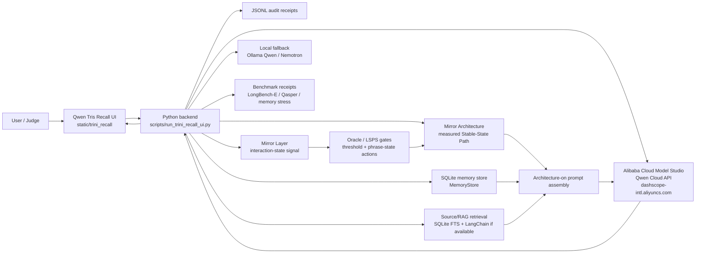

# Qwen Tris MemoryAgent Architecture

Track: MemoryAgent

Qwen Tris Recall is a Qwen Cloud Memory AI Expert Partner. The core comparison
is baseline Qwen prompt-only versus Qwen with Mirror Architecture measured SSP
plus memory/RAG rails. Memory and retrieval preserve the route; SSP is the
measured architecture trajectory being tested.

Mirror Architecture starts with Codex 67 input cohesion: operator signal,
source context, task gate, evidence spine, memory route, and model route aligned
into one coherent input field. The backend turns that input field into a
baseline/off versus architecture-on test route with saved receipts.

The Mirror Layer is treated as the interaction-state subsystem from the patent
spine: it derives a structured state signal from linguistic features,
phrase-pattern features, temporal-sequence features, continuity-aware context,
tone/proxy-tone, and emotional-pattern features. That state signal is used by
the continuity store, Oracle threshold gate, LSPS phrase/state action registry,
and routing layer before the Qwen model call is assembled.



## Runtime Components

- Frontend: `static/trini_recall/index.html`, `app.js`, and `styles.css`.
- Backend: `scripts/run_trini_recall_ui.py`.
- Qwen Cloud API proof code:
  `src/qwen_agent_buildout/trini_recall/alibaba_qwen_cloud_client.py`.
- Provider abstraction:
  `src/qwen_agent_buildout/trini_recall/providers.py`.
- Persistent memory:
  `src/qwen_agent_buildout/trini_recall/memory_store.py`.
- Stable-state packet:
  `src/qwen_agent_buildout/trini_recall/stable_state.py`.
- Evaluation receipts:
  `data/memory_iteration_runs/`, `data/public_benchmark_runs/`, and
  `data/third_party_eval_runs/`.

## Deployment Shape For Submission

The judging deployment should run the Python backend on Alibaba Cloud, with
`QWEN_API_KEY` provided as an environment variable and no secrets committed to
the repository. The backend calls the Qwen OpenAI-compatible endpoint:

```text
https://dashscope-intl.aliyuncs.com/compatible-mode/v1/chat/completions
```

The short deployment proof recording should show:

1. The Alibaba Cloud service/container/log view.
2. Environment variables present without revealing secret values.
3. The backend health/status route or local UI connected to the deployed
   backend.
4. A Qwen Cloud response generated by the deployed backend.

## Public Boundary

This repo exposes source code, public-safe benchmark receipts, and architecture
shape. It does not expose private prompts, API keys, raw private memory rows,
adapter internals, or proprietary Mirror Architecture mechanics.
